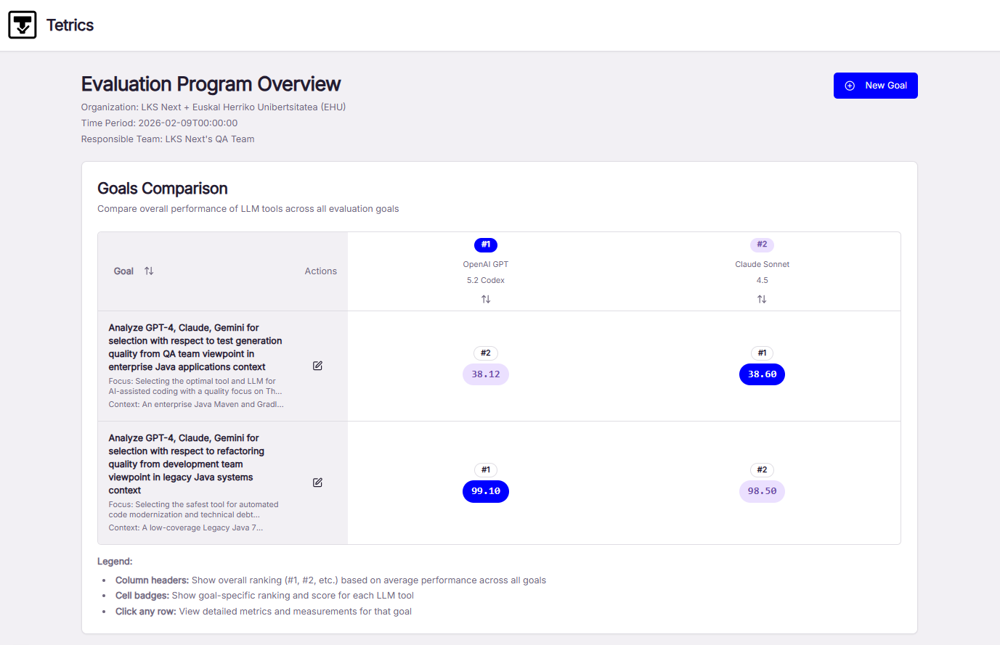

# Tetrics: Systematic LLM Evaluation Framework


A research prototype implementing a domain-independent, continuous evaluation framework for Large Language Model (LLM)-powered development tools.

## 🎬 See It In Action

Tetrics provides an intuitive interface for configuring and managing LLM evaluations through a structured Goal-Question-Metric approach:


*Dashboard showing evaluation programs, metrics, and aggregated scores across multiple LLM configurations*

### Configuring Evaluation Workflows

**Define Evaluation Goals**  
Set up high-level objectives for your LLM evaluation program:


**Create Evaluation Criteria**  
Establish specific criteria aligned with your goals:


**Define Metrics**  
Specify quantitative metrics to measure performance:


**Add Measurements**  
Record evaluation results over time:


## 📖 About

Tetrics is the implementation artifact for the paper **"Beyond the Hype: Enabling Informed LLM Adoption in Industry Through Systematic Evaluation"** by Eneko Pizarro, Maider Azanza, and Beatriz Pérez Lamancha.

The research addresses a critical gap: while LLM adoption in software development accelerates, organizations lack systematic frameworks to continuously evaluate LLM-powered tools. Unlike traditional software dependencies with predictable versioning, these tools evolve continuously, making point-in-time assessments insufficient for informed adoption decisions.

## 🎯 Key Findings

Based on a 20-month longitudinal study across six evaluation cycles (March 2024 - October 2025):

- **Volatile ecosystem**: Models achieving >90% quality scores experienced unexpected regressions in subsequent cycles
- **Hidden dependencies**: GitHub Copilot architectural changes affected all models despite unchanged prompts
- **Availability risk**: High-performing models became unavailable during evaluation periods
- **Custom agents outperform**: Custom-prompted agents outperformed generic tools by 20-90% across quality metrics
- **Continuous monitoring is essential**: Temporal patterns are invisible in point-in-time evaluations

## 🏗️ Architecture

The framework adapts Goal-Question-Metric methodology to LLM-specific challenges including rapid evolution, prompt engineering, and continuous tracking. Key components:

- **Metrics Engine**: Objective evaluation (compilation, coverage, code quality) and expert assessment
- **Evaluation Cycles**: Time-based tracking of multiple models (GPT-4, Claude, Gemini) and tool configurations
- **API-First Design**: RESTful service for managing evaluations, metrics, and aggregated results
- **Database Layer**: Persistent storage with Alembic migrations for evolving schemas
- **Authentication**: Keycloak-based security integration


## 📁 Project Structure

```
├── app/                           # FastAPI application
│   ├── api/                       # REST endpoints
│   ├── models/                    # Database models
│   ├── repositories/              # Data access layer
│   ├── schemas/                   # Pydantic models (API contracts)
│   ├── services/                  # Business logic
│   ├── config/                    # Configuration (database, security, logging)
│   └── core/                      # Core middleware & exceptions
├── alembic/                       # Database migrations
├── front/                         # Next.js frontend (evaluation dashboard)
├── keycloak-config/               # Keycloak realm configuration
├── scripts/                       # Setup and utility scripts
├── docs/                          # Documentation & domain model details
└── docker-compose.yml             # Multi-service orchestration
```

## 🚀 Quick Start

### Prerequisites

- Python 3.11+
- Poetry
- Docker & Docker Compose
- Node.js 18+ (for frontend)

### Installation

1. **Clone and configure**
   ```bash
   git clone <repository-url>
   cd Tetrics
   cp .env.example .env
   ```

2. **Install dependencies**
   ```bash
   poetry install
   ```

3. **Run with Docker Compose**
   ```bash
   docker-compose up --build

   cd ./front/
   npm install
   npm run dev
   ```

4. **Access services**
   - FastAPI API: http://localhost:8000/docs
   - Frontend Dashboard: http://localhost:3000
   - Keycloak Admin: http://localhost:8080/admin (admin/admin123)
   - PostgreSQL: localhost:5432
